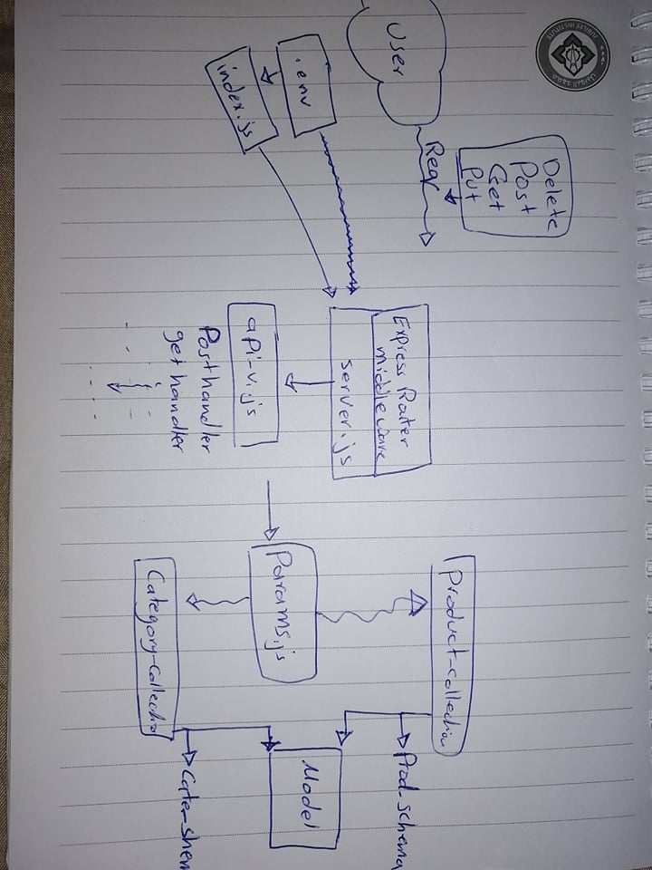

# api-server

### URL of the swagger hub page
[swagger hub](https://app.swaggerhub.com/apis/raghad/default-title/0.1#/)

### installation

`npm install -g json-server`

### start server

`json-server --watch ./data/db.json`

## UML lab 8 

[overview](https://codefellows.github.io/code-401-javascript-guide/curriculum/apps-and-libraries/api-server/)
