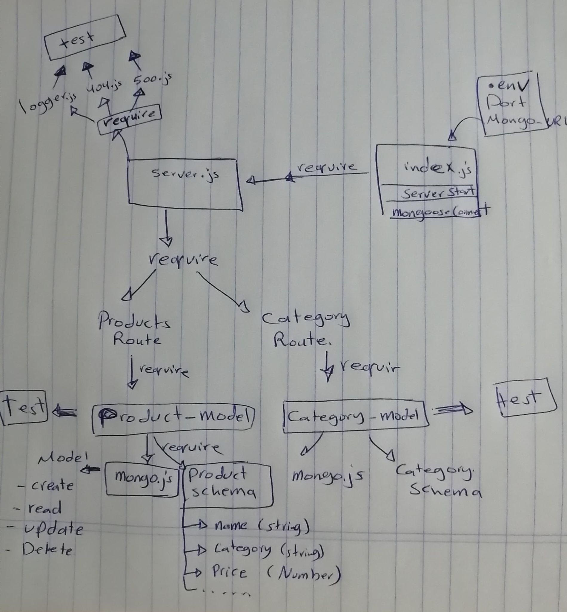

# api-server
An Express/Node.js based API server,  can perform CRUD operations on any data model

### URL of the swagger hub page
[swagger hub](https://app.swaggerhub.com/apis/raghad/default-title/0.1#/)

### start server
`node .`
`json-server --watch ./data/db.json`

## Libraries:
'dotenv'
'express'
'supertest' for testing the server.
'morgan'
'mongoose'
## tests:
$ npm test
$npm run lint

## UML lab 7 

## UML lab 8 

## UML lab 9 

[overview](https://codefellows.github.io/code-401-javascript-guide/curriculum/apps-and-libraries/api-server/)

